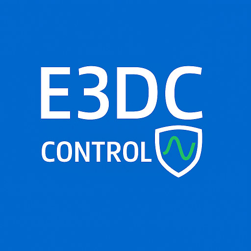

# E3DC-Control Web-Portal & Installer

Ein hochperformantes, modulares Dashboard und Installations-System für die **native Python-Architektur** [A9xxx/Install-E3DC-Control](https://github.com/A9xxx/Install-E3DC-Control) <kbd>Version 5.4.3h</kbd>. Es verwandelt das System in ein intelligentes Smart-Home-Zentrum mit moderner Web-Oberfläche, eigenem Energy Manager und proaktivem Systemschutz.



## Aktuelle Version und Update

Die aktuelle stabile Version ist **5.4.3h**. Hinweise zum Web-, Konsolen- und Docker-Update sowie zur geprüften Wiederherstellung stehen in [doc/Update.md](doc/Update.md). Der sanitierte Root **v5.3.2b** bleibt ausschließlich als Docker-Rückfall-Image verfügbar. Ein Bare-Metal-Programm-Rückfall auf diesen Stand wird nicht angeboten; dort bleibt die Wiederherstellung aus einem verifizierten Datei-Backup der sichere Rückweg.

> [!WARNING]
> **⚠️ Achtung: Nutzung auf eigenes Risiko!**
> Diese Software greift aktiv in Energieflüsse, Speicher-, Wallbox-, Wärmepumpen- und Smart-Home-Logik ein. Installation und Betrieb setzen voraus, dass der Nutzer seine Anlage, Netzvorgaben und Leistungsgrenzen fachlich versteht. Ausführlicher Haftungsausschluss siehe unten.

## ✨ Highlights & Features

> **Aktueller Architekturstand:** Die zentrale Konfiguration liegt weiterhin in `data/e3dc_v4.json`. Der Dateiname bleibt aus Kompatibilitätsgründen bestehen. Eine alte `e3dc.config.txt` wird nur noch für Migration und Legacy-Fallbacks importiert. Details stehen in [doc/V4_Konfiguration_und_Regelung.md](doc/V4_Konfiguration_und_Regelung.md).

> **Config-Schutz:** Standardinstallationen speichern `data/e3dc_v4.json` und lokale Config-Backups mit `660` für Install-User und `www-data`, damit WebUI und Dienste weiter automatisch starten, die Datei aber nicht mehr weltlesbar ist. Der normale Config-Download ist redigiert; der Raw-Download enthält Zugangsdaten und wird nur angeboten, wenn eine Web-PIN gesetzt ist. Der Kompatibilitätsmodus (`664`) ist nur für eigene externe Leser gedacht.

> **Bedienansichten:** Config-Editor und Wallbox-Seite unterscheiden zwischen einfacher Ansicht für Einrichtung und täglichen Betrieb sowie erweiterter Ansicht für alle Detailparameter. Die Logik und Abgrenzung sind in [doc/Frontend_Ansichten.md](doc/Frontend_Ansichten.md) dokumentiert.

> **Neu in 5.4.3h Stable:** Historisch root-installierte Pakete in einem eindeutig gebundenen Benutzer-venv blockieren den Releasewechsel nicht mehr. Root und Installationsnutzer sind die einzigen zulässigen Eigentümer; welt- oder über eine fremde Gruppe beschreibbare Pfade, fremde UIDs, ACLs, Sonderdateien, Hardlinks und nicht freigegebene Symlinks bleiben gesperrt. Der enge Web-Launcher und Matter 0.12.6 aus 5.4.3g sind vollständig enthalten. Installationen bis einschließlich 5.4.3f führen den ersten Wechsel weiterhin einmalig über die administrative Konsole aus.

> **Neu in 5.4.2d Stable:** Der Bare-Metal-Updater bewertet den Wiederanlauf erforderlicher Dienste anhand des belegten systemd-Endzustands statt allein anhand eines Zwischen-Rückgabecodes. Nicht installierte optionale Units werden beim verifizierten Maskenrücklauf als legitimer fehlender Zustand behandelt. Echte Start-, Masken- oder Wiederherstellungsfehler bleiben fail-closed; Writer und Aktoren bleiben dann sicher gestoppt. Die EMS-Regelung entspricht unverändert 5.4.2c.

> **Neu in 5.4.2c Stable:** Ein gültiger Modus-5-Netzladeslot der Wallbox wird nach bestandenen harten Schutzprüfungen nicht mehr durch den rein wirtschaftlichen Pre-Dump-Floor auf 0 A gesetzt. Der Speicher bleibt dabei gegen eine Finanzierung der Fahrzeugladung geschützt; Nutzer-`Aus`, manuelle Sperren, Notstromreserve, Hardwarelimits und Datenfrische bleiben vorrangig. Octopus-Heat-Festfenster werden unabhängig vom Eco-Modus über eine gemeinsame lokale Tarifzeitachse abgebildet, benötigen aber weiterhin jede aktuelle Nutzerfreigabe und schließen bei veralteten oder unpassenden Plänen fail-closed. Die Docker-Dokumentation trennt den GHCR-Normalweg vom lokalen Entwickler-Selbstbau und erklärt die vier Volume- und Backupverträge.

> **Neu in 5.4.2b Stable:** Bereits vor dem Zielwechsel gestartete Alt-Updater können den verifizierten Finalizer über eine eng gebundene Kompatibilitätsbrücke abschließen. Ziel-Commit, Version, Tag, Produktpfad und Finalizer-Dateien werden erneut byte- und metadatengenau geprüft; die privilegierte Fortsetzung läuft nur aus einem privaten, root-eigenen Prüfsnapshot. Eine reine Bereinigungsabweichung nach erfolgreichem Abschluss löst keinen falschen Rollback mehr aus. Die EMS-Regelung entspricht unverändert 5.4.2a.

> **Neu in 5.4.2a Stable:** Ein `EMS_USER_CHARGE_LIMIT`-Readback aus frischen, validen `POWER_SETTINGS` gilt nur bei ausdrücklich konfigurierter `maximumladeleistung` und einer strikt unter 50 W liegenden Abweichung zu `EMS_MAX_CHARGE_POWER` als reflektierter flüchtiger Laderahmen; andernfalls bleibt die USER-Grenze wirksam. Bei Kurvenrückstand öffnet der Storage Manager den Laderahmen in `AUTO` nur bei positiver, frischer E3/DC-only-Evidenz bis `MAX_CHARGE_POWER`; unbekannte oder veraltete Zuordnung bleibt fail-closed, zusätzliche AC-PV weiterhin sanft und DC-first begrenzt. Der Hotfix erteilt keine Netzladefreigabe. Das lokale Heizstab-`PV-AUTO AUS` ist hart und gehalten, ein separat freigegebener Pro3EM-Wärmepumpenpfad bleibt davon unabhängig; das globale `AUTO AUS` stoppt beide. Außerdem blockiert ein aus 5.4.0a weiterlaufender alter Service-Helper den Releasewechsel nicht mehr an der standardmäßig ausgeschalteten Prognosediagnose. Der privilegierte Finalizer startet ausschließlich aus einem separaten root-eigenen, schreibgeschützten Snapshot des freigegebenen Commits; Byte-, Modus-, Eigentümer-, Hardlink- und Symlink-Abweichungen bleiben fail-closed. Der Snapshot liefert nur den geprüften Code; Logs, systemd-Units, Notifier-Rechte, Web-Wrapper und Sudoers-Einträge werden ausschließlich gegen den gebundenen Produktpfad erzeugt.

> **Neu in 5.4.2 Stable:** Die Direktvermarktung plant den ganzen Tag in eindeutigen 15-Minuten-Abschnitten und kehrt nach dem letzten PV-Speicherfenster in die normale Hausversorgung zurück. Ein zusätzlicher wirkungsloser DV-Planer-Shadow prüft alle Abschnitte gegen Planbindung, Datenfrische, Topologie, Netzpunkt und Reserve, ohne die laufende Regelung oder deren Identitäten zu verändern. Kurvenladung und DV-PV-Speichern können optional sanft auf die frische E3/DC-PV-Leistung begrenzt werden, während Entladen in AUTO offen bleibt; eine zusätzliche AC-Speicherroute ist getrennt und standardmäßig ausgeschaltet. Eine neue, ebenfalls ausgeschaltete Lastspitzenbegrenzung schützt feste Zähler-Viertelstunden mit Hysterese und Reservevertrag. Die PV-Prognosediagnose vergleicht abgeschlossene E3/DC-DC-Historienslots rein diagnostisch, speichert Rohdaten privat und verwendet eine versionierte Topologie aus PV-Flächen, Wechselrichtergruppen und Provider-Bindungen. Frische Installationen, der sichere Altprozess-Übergang aus 5.4.0a, Fehlerweitergabe und die verständliche Tarif-, HOLD- und Zwei-Wallbox-Darstellung wurden zugleich korrigiert.

> **Neu in 5.4.1c Stable:** Der OCI-Verifier prüft die bereits exakt gebundene Releaseversion mit einer strengen Versionssyntax statt einer bei jedem Release manuell zu erweiternden Liste. Der vollständige Historien- und Rootvertrag aus 5.4.1b bleibt unverändert aktiv.

> **Neu in 5.4.1b Stable:** Das Docker-Release-Gate lädt die vollständige Git-Historie und kann dadurch den parentlosen Veröffentlichungs-Root unabhängig von der Anzahl späterer Wartungsreleases prüfen. Speicher-, Wallbox-, Wärme- und Direktvermarktungsregelung entsprechen unverändert 5.4.1a.

> **Neu in 5.4.1a Stable:** Der Web-Updater bindet seinen Abschluss an Exitcode und kanonischen Installer-Erfolgsmarker. Sichere Altbestände der privaten ML-Sperrdatei können ohne Änderung von Modell oder Manifest normalisiert werden; neu erzeugte Locks erhalten direkt den richtigen Eigentümer. Frische Installationen laufen wieder über `e3dc-setup`, ohne fälschlich eine halbe Release-Bootstrap-Bindung zu erzeugen. Die Betriebsdokumentation trennt außerdem die abzuschaltende E3/DC-Wetterladung von der weiterhin aktiven Open-Meteo-/Forecast-Prognose.

> **Neu in 5.4.1 Stable:** Die openWB Pro startet und wechselt Phasen bestätigungsgebunden, ohne dass der 480-Sekunden-Schutz den Wiederanlauf blockiert. Fahrzeug-, Nutzer- und Ladepunktgrenzen sowie ein- und dreiphasige Ladeleistungen fließen in eine leistungsfaire Mehr-Wallbox-Zuteilung ein. Der Web-/Konsolen-Updater härtet den unterstützten Erstwechsel aus 5.3.2b; die Docker-Migration prüft Zielimage und gestartete Version. Docker-Images werden in einem zusammenhängenden, attestierten Build-und-Promote-Lauf erzeugt. Netzfrequenz, SG-Ready-/Shelly-Aktivität und wichtige Regelkonflikte sind im Frontend sichtbar. Batterie-Vitals adressiert jeden DCB-Pack einzeln und bindet vorhandene Antwortindizes. Gemeldete Status- und Fehlertexte im Konfigurationseditor werden ohne HTML-Injektion dargestellt. Eine echte phasenaufgelöste Anschlussfreigabe über 20 A bleibt fail-closed, bis ein bestätigter PCC-RMS-Stromvektor vorliegt.

> **Neu in 5.4.0e Stable:** Der direkte Übergang aus der eigens dafür veröffentlichten Übergangsbasis 5.3.2b startet nur die sieben Pflichtdienste und bereits vor dem Wechsel installierte, in der eingefrorenen Konfiguration aktive Zusatzdienste. Deaktivierte Zusatzdienste bleiben aus. Alte Konfigurationsfelder allein aktivieren keine Wallbox-, Wärme- oder Integrationsdienste. Solche konfigurierten, aber nicht installierten Zusatzmodule werden im Update sichtbar genannt und können anschließend bewusst über das Install-Center eingerichtet werden. Die Betriebskonfiguration und die openWB-Pro-Regelung bleiben unverändert. Ältere oder nicht verwandte Installationen wechseln zuerst über den dokumentierten Bootstrap auf 5.3.2b.

> **Neu in 5.4.0a Stable:** Das Core-Update ist von optionalen Matter-Paketen getrennt, der Web-Updater erkennt und repariert eine reine CRLF-Beschädigung seines veröffentlichten Wrappers kontrolliert, und alte Shelly-EM-Zähler der ersten Generation können über ihre lokale read-only-Status-API eingebunden werden.

> **Neu in 5.4.0 Stable:** Speicher, Direktvermarktung, Wallbox und Wärmeverbraucher verwenden einen eindeutigen Regel-Owner und einen vor jedem Hardwareausgang erneut geprüften Anlagenkontext. Plan, Slot, Freigabe, ACK und Readback bleiben gebunden. Interne DC-PV und zusätzliche AC-Erzeuger werden getrennt bilanziert; DC- und Netzpunktdruck werden mit dem größeren Wert statt als Summe bewertet. openWB Pro erhält eine bestätigungsgebundene Start-Recovery. Das Mehr-Wallbox-Balancing verteilt anhand der L1/L2/L3-Stromvektoren und der Netzpunktreserve; ein- und dreiphasige Amperewerte werden nicht pauschal addiert. Die strengere leistungsfaire Zuteilung und die konservative PCC-RMS-Freigabe gelten ab 5.4.1. Die ruhige PV-Kurve erlaubt bei laufender Ladung höchstens 75 Wh Batteriestützung. Der manuelle iDM-Scanner liest Register 1006 ausschließlich einmalig per FC04. Mobile Energiefluss-Badges speichern Desktop- und Tablet-Positionen revisionssicher getrennt. Update, Backup und Web-Planung sind transaktional gehärtet.

> **Dynamische Preisquellen:** SMARD bleibt die Standardquelle für Börsenstrompreise. Optional kann ein ENTSO-E Transparency Platform Security Token als 15-Minuten-Fallback hinterlegt werden; danach bleibt aWATTar der grobe Stundenfallback. Den ENTSO-E-Zugang erhältst du über einen Transparency-Platform-Account, eine E-Mail mit Betreff `RESTful API access` an `transparency@entsoe.eu`, die Freigabe durch ENTSO-E und anschließend die Token-Erzeugung im Account.

### 📊 Modernes Live-Dashboard & Statistik
* **Echtzeit-Energiefluss:** Animierte Darstellung aller Energieflüsse (Haus, PV, Netz, Batterie, Wallbox, Wärmepumpe). Nodes können je Ansicht verschoben, farblich angepasst und per Standardlayout zurückgesetzt werden.
* **Smart-Home Visualisierung:** Automatische Einblendung eines Heizstabs (sofern konfiguriert) und eines pulsierenden, roten Warn-Banners bei einem E3DC-Notstrom-Einsatz.
* **Tagesstatistik:** Hochpräzise Echtzeit-Berechnung von **Autarkie** und **Eigenverbrauch** sowie detaillierte Aufschlüsselung der Energieverteilung in kWh und Prozent.
* **CO₂-Fußabdruck & Gamification:** Ein animierter CO₂-Baum wächst mit dem Autarkiegrad – vom Setzling 🌱 zum vollen Wald 🌲🌳🌲. Zeigt die täglich eingesparten kg CO₂ basierend auf dem deutschen Strommix (0,38 kg/kWh) an.
* **Energie-Quellen (Mix):** Ein interaktives Doughnut-Chart mit klickbarer Legende (PV, Einspeisung, Bezug, Batterie laden/entladen) und farbcodierten Energiebilanz-Badges auf dem Smartphone.
* **Langzeit-Archiv (SQLite):** Betrachte interaktive Balkendiagramme für die Bilanzen der letzten Tage, Monate oder Jahre inkl. Stromkosten-Mittelwert. Ein administrativer **Statistik-Editor** erlaubt zudem die rasche Korrektur von Messfehlern direkt in der Datenbank.
* **Aufgeräumtes Design:** Ein globales Auge-Icon in der Kopfleiste erlaubt es dir, detaillierte technische Parameter in Echtzeit aus dem Dashboard auszublenden, um eine wunderschön puristische und ablenkungsfreie Oberfläche zu schaffen.
* **Responsive & PWA:** Vollständig optimiert für Desktop und Mobile (Dark/Light Mode). Dank PWA-Support wie eine native App installierbar. Inklusive optionalem **PIN-Schutz**.
* **🧭 Batterie-Diagnostik (Vitals):** Ein dediziertes Batterie-Gesundheits-Dashboard zeigt SOH, Ladezyklen, Zelltemperaturen (Min/Max) und den Zell-Drift (Spannungs-Spread in mV) pro Pack in Echtzeit an. Basiert auf dem Open-Source-Projekt [RSCPGui von rxhan](https://github.com/rxhan/RSCPGui) via direktem RSCP-Zugang zum BMS der E3DC.

### ⚡ Smart Charging & Luxtronik Energy Manager
* **Multi-EV Support (Flotten-Management):** Das System unterstützt mehrere Fahrzeuge per Bluelink, MQTT, openWB-SoC oder manueller Vorlage. Auf der Wallbox-Seite werden Fahrzeuge direkt pro Wallbox zugeordnet, damit Akku, Ziel-SoC und Ladeleistung auch bei Wallboxen ohne Fahrzeugerkennung eindeutig passen.
* **Dynamische Ladezeit-Berechnung:** Das Dashboard (und das Backend) berechnet durchgängig anhand der aktuellen Ladeleistung vollautomatisch die geschätzte Restdauer bis zum Erreichen von 100% sowie zum Ziel-SoC.
* **Universal-Wallbox Integration:** Nativer, entkoppelter Python Wallbox Manager mit Dual-WB Support für E3DC, openWB/openWB Pro und go-e. openWB Pro wird direkt über `connect.php` als Aktuator geführt, normale openWB-Software bleibt sauber in Primary-/Secondary-Rollen getrennt. Die sichtbaren Modi sind `Aus`, `PV-Kurve ruhig`, `Grundladung stabil`, `PV + Akku bis Untergrenze`, `Sofort bis Preislimit` und `Akku bis Abfahrt`; geplantes Netzladen greift in allen aktiven Modi und bleibt bei `Aus` gesperrt, spontane Marktfreigaben für Wallbox-Netzladen benötigen dagegen `Sofort bis Preislimit`. Im Beobachten-Modus kann der Storage Manager optional nur den Hausspeicher bis zur Untergrenze führen, ohne Wallbox-Befehle zu senden.
* **V2H/V2G-Vorbereitung (read-only):** Bidirektionale Wallboxleistung und gemeldete Fähigkeitsdaten werden erkannt und angezeigt. Eine aktive V2H-/V2G-Steuerung oder SoC-Abschaltung ist derzeit nicht freigegeben. Details: [V2H/V2G-Status](doc/V2x_Dokumentation.md).
* **Intelligenter SoC- und Reichweiten-Sync:** Verzichtest du auf eine direkte Fahrzeuganbindung, kann der **SoC des Fahrzeugs am Dashboard manuell übermittelt werden**. Das System rechnet (interpoliert) ab dann vollautomatisch im Hintergrund die eingeladene Energie ein. Eine aktuell von openWB gemeldete Gesamtreichweite hat Vorrang; nur wenn dieser Wert fehlt, veraltet oder nicht zur aktuellen Fahrzeugidentität passt, berechnet E3DC-Control die Restreichweite aus Akku-Kapazität und hinterlegtem Verbrauch.
* **Universal Wärmepumpen-Integration:** Native Anbindung für **Luxtronik** (WebSocket), **IDM-Wärmepumpen** (Modbus-TCP) und **Stiebel Eltron ISG/WPM** (read-only Live-Daten). IDM kann mit PV-Überschuss und konfigurierbarer Leistungsobergrenze ruhig als Grundlast laufen; Stiebel liefert Livewerte und nutzt optional einen externen Shelly-Leistungsmesser für die elektrische Live-Leistung in Dashboard/R5. SG-Ready per WLAN-Shelly bleibt als robuste Freigabe für andere Marken verfügbar. Details: [Stiebel-Eltron-ISG-Dokumentation](doc/Stiebel_Eltron_ISG.md).
* **Storage Simulator & adaptive Ladekurve:** Die Anlage plant vollautomatisch voraus. Wetterprognosen, saisonaler Nachtverbrauch, EPEX/Eco-Score und optionales Mittagsziel erzeugen eine geglättete Soll-SoC-Kurve. Der Storage Manager führt die Kurve weich über `iFc`, Kontroll-SoC und gedämpften Aufholbedarf; [Pre-Dump](doc/Pre_Dump.md) schafft vor Kurvenstart Platz gegen Abregelung. Die Abregelreserve hält an passenden Hochleistungs-/Cloud-Edge-Tagen Speicherplatz für PV-Spitzen frei, ohne echten Netz-/WR-Abregeldruck zu blockieren. Der optionale [Unwetterwächter](doc/Unwetterwaechter.md) kann DWD-Warnungen als Kurvenanker oder Nachtreserve berücksichtigen; Speicher-Netzladen und Speicher-Halten im normalen Marktpfad bleiben getrennte, standardmäßig ausgeschaltete Opt-ins und werden beim Ausführen erneut gegen die aktuelle Freigabe geprüft. Zusätzlich blockiert `PV-autark zuerst` den normalen Marktpfad, wenn Speicher plus erwartete PV den restlichen Horizont decken; fällt der SOC unter die Low-SOC-Schwelle, darf ein bewusst freigegebener Speicherpfad wieder wirtschaftlich prüfen. Live-PV und Netzexport haben beim normalen Markt-Netzladen Ausführungsvorrang: dann wartet der Marktpfad in AUTO, statt GRID vorzuziehen.
* **E3/DC-PV-Ladebegrenzung:** Kurvenladung und DV-PV-Speichern können optional auf die frisch ermittelte E3/DC-PV-Leistung begrenzt werden. E3/DC bleibt dabei in AUTO, die Hausversorgung darf jederzeit entladen und zusätzliche AC-PV erhöht den flüchtigen Laderahmen nicht. Bei fehlendem gültigem PV-Split werden diese PV-basierten Ladepfade sicher auf 0 W begrenzt; Preis- und ausdrücklich freigegebenes Netzladen bleiben eigenständig.
* **Optionale AC-Speicherroute:** Energie eines zusätzlichen AC-Wechselrichters kann getrennt für Reserve oder wirtschaftliches Speichern freigegeben werden. Standard ist `Aus`; E3/DC-DC bleibt vorrangig, Netzladen wird nicht freigegeben und fehlende Topologie- oder Unterdeckungsnachweise sperren den Pfad.
* **Peak Shaving am Netzbezug:** Die optionale Lastspitzenbegrenzung schützt feste Zähler-Viertelstunden mit Sicherheitsabstand, Leistungs- und SoC-Hysterese, Messlückenkontrolle und einem Speicherpuffer oberhalb der Notstromreserve. Eine Netz-Nachladung dieses Puffers benötigt eine eigene ausdrückliche Freigabe.
* **PV-Prognosediagnose:** Ein standardmäßig ausgeschalteter, rein lesender Diagnosedienst kann E3/DC-DC-Prognosen mit abgeschlossenen nativen 15-Minuten-Historienslots vergleichen. Die Werte bleiben Diagnose, wirken weder auf Modelle noch Regelung zurück und liegen privat außerhalb des Webverzeichnisses. PV-Flächen, Wechselrichtergruppen und Provider-Bindungen werden als versionierter Topologievertrag verwaltet. Details: [PV-Prognose](doc/PV_Prognose_Berechnung.md).
* **Geplante Lastfenster:** Große, nicht direkt steuerbare Verbraucher können als enges Zeitfenster mit statischer Leistung hinterlegt werden. Der Simulator berücksichtigt die Last in der Prognose, der Manager schützt den Speicher aber erst, wenn die Last im Fenster plausibel sichtbar ist. Details: [Geplante Lastfenster](doc/Geplante_Lastfenster.md).

### 🚀 Maximale Performance & SD-Karten-Schutz
* **RAM-Disk für hochfrequente Laufzeitdaten:** Live-Werte und häufig wechselnde Energie-, Fahrzeug- und Wallboxzustände werden im Arbeitsspeicher gehalten. Dauerhafte Wiederanlaufstände entstehen nur bei fachlichen Änderungen, sicherheitsrelevanten Übergängen und zusätzlich höchstens alle zwei Minuten; das senkt die Schreibzugriffe auf SD-Karten deutlich. Bare-Metal-Dienste und Docker starten nur mit einem exakt gemounteten `tmpfs`; Diagnose und Reparatur beschreibt der [RAM-Disk-Betriebsvertrag](doc/RAM-Disk_Betrieb.md).
* **Native Python Live-API:** Der RSCP-Live-Dienst schreibt atomare JSON-Werte direkt in die RAM-Disk. Ungültige Werte wie `NaN` werden abgefangen, damit Dashboard, Historie und MQTT-Hub stabil weiterlaufen.
* **Ein Live-Snapshot für interne Verbraucher:** WebSocket, MQTT, Matter und Watchdog lesen den validierten RAM-Zustand direkt, statt fortlaufend Apache und PHP mit vollständigen Liveabfragen zu beschäftigen.
* **Begrenzte Persistenz:** Maschinenlesbare Formate ersetzen keine Aufbewahrungsgrenze. Produktlogs, Historien und Docker-Engine-Logs werden deshalb getrennt rotiert beziehungsweise begrenzt; Backups und fachliche Langzeitdaten werden nicht still gelöscht.
* **Klassisches und modernes Frontend:** Beide Dashboard-Layouts bleiben produktiv auswählbar und unterstützen die Detailstufen kompakt, normal und detailreich.
* **Frontend-Optimierung:** Statische Assets (JavaScript) werden automatisch komprimiert (minifiziert) und mit Cache-Busting-Mechanismen ausgeliefert, um die Ladezeiten des Dashboards zu minimieren.

### 🏠 Smart Home Integration
* **Apple Home / Google Home (lokale Matter Bridge, nicht zertifiziert):** Drei read-only Statusschalter bilden Wallbox-Ladung, PV-Produktion und Netzeinspeisung ab. Passcode und Discriminator werden installationsindividuell erzeugt, Kopplungsschlüssel bleiben privat im persistenten Matter-Storage, und bestehende Fabrics werden bei einem Update nicht gelöscht. Befehle aus Matter werden nicht an die Anlage weitergegeben. Details: [Matter Bridge](doc/Smart_Home_Matter.md).
* **Web-Push Benachrichtigungen:** Native Push-Nachrichten für Alarme (Notstrom, HA-Failover) und dynamische Statusmeldungen (Ziel-SoC erreicht, Erinnerungen) direkt auf das Smartphone; dafür ist keine Messenger-Integration erforderlich.
* **E3DC MQTT Hub (Auto-Discovery):** Das System pusht vollautomatisch alle Live-Werte (PV, Netz, WP, Wallbox, Strompreis) an deinen MQTT-Broker. Direkte evcc/openWB-Leistungstopics wie `evcc/loadpoints/1/chargePower` können ohne Home Assistant als reale Wallboxleistung eingebunden werden.
* **Entkoppelte Architektur:** Dedizierte Dienste lesen und schreiben JSON-Daten hocheffizient über die RAM-Disk und halten Netzwerk-, Web- und Regelungslogik voneinander getrennt.

### 🛡️ System-Stabilität & Watchdog
* **High Availability Cluster (HA):** Unterstützung für einen zweiten Raspberry Pi als Ausfall-Backup (Aktiv/Passiv) mit überwachten Heartbeats, Konfigurationsabgleich und kontrolliertem Rollenwechsel. Umschaltzeit und Wiederanlauf hängen von Installation und Dienstzustand ab.
  * **Langzeit-Sync:** Die gesamte Ladehistorie und SQLite-Datenbank wird in Echtzeit redundant auf dem Slave gespiegelt.
* **Shadow-Vergleichs-/Testinstanz:** Eine optionale zweite Instanz liest über einen eigenen Peer-Token ausschließlich positiv typisierte Betriebsprojektionen der aktiven Anlage und berechnet lokale Vergleichsentscheidungen. Fehlende, veraltete oder unvollständige Pflichtdaten halten die betroffene Auswertung pausiert. Sie erhält keine Anlagenzugangsdaten, sendet keine Hardwarebefehle und übernimmt niemals per Failover. Details: [Shadow-System](doc/Shadow_System_Konzept.md).
* **Systemd-Dienste:** Alle Kernmodule (`e3dc-live`, Storage Manager, Storage Simulator, Wallbox Manager, MQTT-Hub und optionale Verbraucher) laufen als robuste Hintergrunddienste mit Auto-Restart-Fähigkeit.
* **Piguard Watchdog:** Überwacht das Netzwerk, den SD-Karten-Speicher und Dateihänger. Startet bei Bedarf einzelne Dienste (oder den Raspberry Pi) intelligent neu.
* **Telegram-Benachrichtigungen:** Erhalte tägliche Statusberichte (Uptime, Temperatur), Tagesstatistiken zur Energieverteilung sowie einen detaillierten Wochenrückblick direkt auf dein Smartphone. Komfortabel über das Web-UI ohne lästige Cronjobs konfigurierbar.
* **Betriebswartung:** Log-Rotation und begrenzte Update-/Installer-Backups reduzieren den Speicherbedarf. Die Rechteprüfung kann bekannte Abweichungen korrigieren; Systemzustand und freier Speicher bleiben zu überwachen.

### 🔄 Auto-Update & Rollback
* **Web-Updater:** Freigegebene Stable-Stände lassen sich über einen argumentlosen, root-eigenen Systemjob im Web-Dashboard (`index.php`) installieren. Der Launcher akzeptiert weder freie Installer-Aktionen noch Pfade, Tags, Reparaturen oder Rückfälle, bindet den veröffentlichten Ausgangsstand und führt den Installer aus einem versiegelten Snapshot aus. Der Browser zeigt den Installationsfortschritt; Fehler brechen den Vorgang ab und bleiben diagnostizierbar.
* **Optionale Updateprüfung:** Das System kann nachts nach einem freigegebenen Stable-Stand suchen und den geprüften Installerweg starten.
* **Umgebungsgebundener Rückfall:** Docker kann auf das in `UPDATE_POLICY.json` exakt gebundene Image `v5.3.2b` zurückgesetzt werden. Bare-Metal-Installationen bieten für diesen Altstand keinen Programm-Rückfall an; verifizierte Datei-Backups bleiben wiederherstellbar.

## 💬 Community & Support

Besuche unseren offiziellen Support-Thread im Photovoltaikforum für Fragen, Feedback und Updates:
👉 **[E3DC-Control (Native Python): KI-Prognose, dynamische Stromtarife & Wallbox-Steuerung](https://www.photovoltaikforum.com/thread/259876-e3dc-control-native-python-ki-prognose-dynamische-stromtarife-wallbox-steuerung/)**

---

## Haftungsausschluss (Disclaimer)

Die Software wird ohne Gewähr für Fehlerfreiheit, Verfügbarkeit, Wirtschaftlichkeit oder Eignung für einen bestimmten Zweck bereitgestellt. Soweit gesetzlich zulässig, übernehmen die Autoren und Beitragenden keine Haftung für direkte oder indirekte Schäden, Fehlsteuerungen, Energieverluste, Netzbezug, entgangene Einspeisevergütung, Hardwareverschleiß, Datenverlust oder Folgekosten, die durch Nutzung, Fehlkonfiguration, Updates oder Ausfall der Software entstehen. Sicherheitsrelevante Einstellungen des Herstellers, Elektroinstallation, Netzbetreiber-Vorgaben und gesetzliche Anforderungen haben immer Vorrang.

---

## Herkunft & Lizenz

E3DC-Control ist eine eigenständige Python-Implementierung. Die robuste Regelbasis ist fachlich vom C++-Projekt von Eberhard Mayer inspiriert und wurde mit dessen Zustimmung als Grundlage verstanden und eigenständig neu implementiert. Details stehen in [NOTICE.md](NOTICE.md).

Dieses Projekt steht unter der **GNU Affero General Public License v3.0 oder später (AGPL-3.0-or-later)**. Private Nutzung, Anpassung und Community-Weiterentwicklung sind ausdrücklich willkommen.

Wer das Projekt, abgeleitete Versionen oder darauf basierende Dienste öffentlich bereitstellt, verteilt oder kommerziell nutzt, muss die Bedingungen der AGPL einhalten und den vollständigen zugehörigen Quellcode offenlegen. Kommerzielle Sonderlizenzen oder Integrationen außerhalb der AGPL sind nur nach vorheriger schriftlicher Zustimmung möglich.

---

## 💻 Systemvoraussetzungen

E3DC-Control ist ein ressourcenschonendes System zur Steuerung und Optimierung des Energiemanagements. Es läuft auf klassischen Raspberry-Pi-Systemen ebenso wie in virtuellen Umgebungen wie Proxmox, Docker, ESXi oder auf kleinen Intel-/AMD-Hosts.

### Hardware-Anforderungen

Die folgenden Werte sind Richtwerte für einen stabilen Dauerbetrieb:

| Komponente | Minimal, z.B. Raspberry Pi 3 | Empfohlen, z.B. Raspberry Pi 4 / 5 |
| :--- | :--- | :--- |
| **CPU** | 1 bis 2 Cores | 2 Cores |
| **Arbeitsspeicher** | 1 GB RAM | 2 GB RAM |
| **Swap-Speicher** | mindestens 512 MB | 1 GB |
| **Speicherplatz** | 8 GB freier Speicher | 16 GB oder mehr |

> **Hinweis zu Speicherplatz und RAM-Disk:** Eine normale Installation kann inklusive Paketen, Webdateien, Python-Umgebung, Logs, Diagnose- und Backupdaten bereits mehr als 4 GB belegen. Unter 8 GB freiem Speicher wird der Betrieb schnell eng. Werden temporäre Daten und Logfiles in einer RAM-Disk gehalten, schont das SD-Karten und SSDs, belegt aber direkt physischen Arbeitsspeicher. Für RAM-Disk, Docker, ML-Prognose oder größere Diagnosepakete sind 2 GB RAM dringend empfohlen.
>
> **Docker benötigt ein 64-Bit-System:** Die veröffentlichten Images unterstützen
> ausschließlich `linux/arm64` und `linux/amd64`. `armhf` beziehungsweise
> `linux/arm/v7` wird nicht angeboten. Die Angabe „Raspberry Pi 3“ in der
> Minimalspalte beschreibt daher nur den klassischen Betrieb; für Docker sind
> ein 64-Bit-Betriebssystem und mindestens 2 GB RAM empfohlen.

### Betrieb in virtuellen Umgebungen

**LXC-Container, empfohlen für Proxmox:** LXC teilt sich den Kernel mit dem Host und arbeitet sehr effizient. Für E3DC-Control reichen in der Praxis meist 2 vCores, 1 GB RAM und 512 MB bis 1 GB Swap.

**Virtuelle Maschine, z.B. KVM/ESXi:** Eine VM bringt den Eigenbedarf des Gast-Betriebssystems mit. Plane 2 vCores, 1 bis 2 GB RAM und 1 GB Swap ein.

> **Wichtig:** Ein Betrieb ohne Swap wird in VMs nicht empfohlen. Bei Lastspitzen, etwa während `apt-get`-Updates oder Modulinstallationen, kann der Linux-Kernel sonst Prozesse über den Out-of-Memory-Killer beenden.

---

## Empfohlene E3/DC-Geräteeinstellungen

E3DC-Control ergänzt die Schutz- und Leistungsgrenzen des Hauskraftwerks, ersetzt
sie aber nicht. Für eine eindeutige Regelzuständigkeit gelten folgende
Grundeinstellungen:

| Bereich | Empfehlung | Begründung |
| :--- | :--- | :--- |
| **RSCP-Zugang** | Am E3/DC aktivieren und ein eigenes AES-Passwort setzen; IP, Benutzer und Passwörter anschließend im Config-Editor von E3DC-Control hinterlegen. | Live-Daten, Speicherregelung und Vitals benötigen einen gültigen lokalen RSCP-Zugang. |
| **Wetterbasiertes Laden / Laden nach Wetterprognose im E3/DC** | Ausschalten, wenn E3DC-Control die Speicher-Ladekurve führt. Im reinen Beobachtungsbetrieb darf die E3/DC-Funktion aktiv bleiben. | Andernfalls arbeiten zwei Ladeplaner gegeneinander; das E3/DC kann Batterieladung zurückhalten, obwohl E3DC-Control bereits eine passende Ladeobergrenze vorgibt. |
| **Open-Meteo-/Forecast-Prognose in E3DC-Control** | Aktiv lassen und die Dachflächen korrekt konfigurieren. | Diese Prognose gehört zu E3DC-Control und arbeitet unabhängig von der abgeschalteten E3/DC-Wetterladung weiter. |
| **Notstromreserve** | Die physische Reserve am E3/DC beibehalten und die Untergrenzen in E3DC-Control niemals darunter setzen. | Die Herstellerreserve ist eine harte Schutzgrenze und hat Vorrang vor Preis-, Komfort- und Autarkieoptimierung. |
| **Netz-, Batterie- und Wechselrichtergrenzen** | Hersteller- und Netzbetreibergrenzen nicht abschalten oder erhöhen. | E3DC-Control berücksichtigt diese Grenzen, ersetzt aber weder Geräteschutz noch Elektroplanung. |
| **Weitere Speicher- oder Wallbox-Regler** | Pro Aktor genau einen aktiven Regler verwenden. Alte C++-Dienste, zweite EMS-Regler oder parallele Wallbox-Automationen dürfen nicht gleichzeitig Befehle senden. | Mehrere Entscheider können sich gegenseitig überschreiben und Regelunruhe oder ausbleibende Ladung verursachen. |
| **Systemzeit** | E3/DC- und Host-Zeit einschließlich Zeitzone und NTP korrekt halten. | Preisfenster, Forecast, 15-Minuten-Slots und Historie benötigen eine gemeinsame Zeitbasis. |

E3DC-Control verändert die E3/DC-Wettereinstellung bewusst nicht automatisch.
Wenn das Hauskraftwerk gleichzeitig `Laden gesperrt` und `Warten auf
Sonnenschein` meldet, wird dieses externe Veto diagnostisch angezeigt. Weitere
Details stehen unter [V4-Konfiguration und Regelung](doc/V4_Konfiguration_und_Regelung.md).

---

## 🛠️ Installation (Klassisch auf dem Raspberry Pi)

Die Installation erfordert einen Raspberry Pi oder ein Debian-basiertes System und einen normalen Benutzer mit `sudo`-Rechten. Gemeint ist **nicht**, dass du dich als Benutzer `root` anmelden sollst. Installiere aus einem eigenen Admin-Benutzer, z.B. `pi`, `admin` oder `e3dc`.

Falls noch kein geeigneter Benutzer vorhanden ist:

```bash
sudo adduser e3dc
sudo usermod -aG sudo e3dc
su - e3dc
```

Danach die Installation als dieser Benutzer starten. Der Installer fragt bei Bedarf das `sudo`-Passwort ab und richtet Systemdienste, Webrechte und Paketabhängigkeiten ein.

### Schritt 1: System vorbereiten & Klonen
```bash
sudo apt update && sudo apt install -y git
export E3DC_INSTALL_PATH="$HOME/Install"
git clone https://github.com/A9xxx/Install-E3DC-Control.git "$E3DC_INSTALL_PATH"
```

### Schritt 2: Installer starten
Wechsle in das neue Verzeichnis und starte das Setup-Skript. Es hebt nur die
Schritte mit Systemrechten selbst über `sudo` an; der Checkout bleibt im Besitz
deines normalen Benutzers:
```bash
cd "$E3DC_INSTALL_PATH"
bash ./e3dc-setup
```

`fix_bom.py` ist bei einem normalen Git-Clone nicht erforderlich. Nur wenn der
Quellbaum zuvor über Windows kopiert und dabei tatsächlich beschädigt wurde,
kannst du ihn als normaler Benutzer einmal mit `python3 fix_bom.py` prüfen.

### Schritt 3: Installation / Update starten
Wähle im interaktiven Menü für eine Ersteinrichtung die Option **"1 Installation / Update"**. Der Installer richtet die benötigten Pakete, Dienste, Webdateien, Rechte und die sichere Grundkonfiguration ein. Falls du aus älteren Anleitungen die Nummer `11` kennst: Diese Eingabe wird aus Kompatibilitätsgründen ebenfalls akzeptiert.

Das Konsolenmenü ist bewusst klein gehalten:

```text
1) Installation / Update
2) Systemstatus anzeigen
3) Rechte prüfen & korrigieren
4) Notfallmodus / System reparieren
5) Policygebundener Programm-Rückfall (falls für Bare Metal freigegeben)
6) Backup erstellen / verwalten
7) Expertenmenü
8) Systempakete vorbereiten
9) Deinstallation
q) Beenden
```

Erweiterungen wie Docker, Energy Manager, native Wallbox, MQTT, Bluelink oder HA liegen gesammelt im **Expertenmenü**. Normale Konfigurationen erfolgen danach im WebUI.

Das Expertenmenü ist in 10er-Blöcke sortiert:

```text
Kernsystem & Update
  14) Rollback (Datei-Backup)
Umgebung & Python
  21) Python venv neu aufbauen (Reparatur)
  22) Python venv Namen ändern
Docker Migration & Verwaltung
  31) Zu Docker wechseln (Auto-Install & Migration)
  32) Docker auflösen & zum lokalen System zurückkehren
Erweiterungen & Smart Home
  41) Energy Manager
```

---

## 🐳 Installation (Via Docker)
E3DC-Control kann alternativ komplett isoliert über Docker betrieben werden.
Das Image unterstützt ausschließlich 64-Bit-ARM (`linux/arm64`, Raspberry Pi)
und 64-Bit-x86 (`linux/amd64`, Intel/AMD, Synology, QNAP). Ein 32-Bit-
Raspberry-Pi-OS (`armhf`/`arm/v7`) kann dieses Image nicht laden.

> **Docker läuft ausschließlich als Standalone-System mit `ha_mode=off`.**
> HA-Master/-Slave und die read-only Shadow-Instanz bleiben Bare-Metal-
> Betriebsarten. Beim Wechsel einer laufenden nativen Installation verwende
> Menüpunkt **31**, damit Supervisoren und Host-Dienste vor dem Containerstart
> kontrolliert gestoppt und deaktiviert werden; starte nicht parallel manuell
> einen Container.

**Voraussetzung:** Docker muss installiert sein. Git wird im folgenden
Komfortweg nur benötigt, um die mitgelieferte `docker-compose.yml` zu beziehen;
der Anwendungscode stammt im Normalbetrieb aus dem veröffentlichten GHCR-Image.

### Schritt 1: Docker installieren
```bash
DOCKER_ARCH="$(dpkg --print-architecture)"
case "$DOCKER_ARCH" in
  arm64|amd64) ;;
  *) echo "Nicht unterstützte Docker-Architektur: $DOCKER_ARCH (benötigt: arm64 oder amd64)" >&2; exit 1 ;;
esac
if ! command -v docker >/dev/null 2>&1; then
  test ! -S /run/docker.sock
  if sudo test -e /var/lib/docker; then
    test -z "$(sudo find -P /var/lib/docker -mindepth 1 -maxdepth 1 -print -quit)" || {
      echo "Unbekannter Bestand unter /var/lib/docker; Docker-Installation abgebrochen." >&2
      exit 1
    }
  fi
fi
sudo apt-get update
sudo apt-get install -y ca-certificates curl git
sudo install -m 0755 -d /etc/apt/keyrings
. /etc/os-release
DOCKER_REPO=debian
DOCKER_CODENAME="${VERSION_CODENAME}"
if [ "${ID}" = "ubuntu" ] || echo "${ID_LIKE:-}" | grep -qw ubuntu; then
  DOCKER_REPO=ubuntu
  DOCKER_CODENAME="${UBUNTU_CODENAME:-$VERSION_CODENAME}"
fi
sudo curl -fsSL --proto '=https' --tlsv1.2 \
  "https://download.docker.com/linux/${DOCKER_REPO}/gpg" \
  -o /etc/apt/keyrings/docker.asc
sudo chmod a+r /etc/apt/keyrings/docker.asc
printf 'Types: deb\nURIs: https://download.docker.com/linux/%s\nSuites: %s\nComponents: stable\nArchitectures: %s\nSigned-By: /etc/apt/keyrings/docker.asc\n' \
  "$DOCKER_REPO" "$DOCKER_CODENAME" "$(dpkg --print-architecture)" | \
  sudo tee /etc/apt/sources.list.d/docker.sources > /dev/null
sudo apt-get update
sudo apt-get install -y docker-ce docker-ce-cli containerd.io docker-buildx-plugin docker-compose-plugin
# Der Paketlauf kann den Daemon bereits gestartet haben. Fremde Container und
# Volumes bleiben unberührt; nur bestehender E3DC-Control-Bestand blockiert die
# frische Installation und gehört in den dokumentierten Updateweg.
E3DC_CONTAINER_CONFLICTS="$(
  sudo docker container ls -a \
    --format '{{.Names}}|{{.Image}}|{{.Label "com.docker.compose.service"}}' |
  awk -F '|' '$1 == "e3dc-control" || $2 ~ /(^|\/)(install-)?e3dc-control([:@]|$)/ || $3 == "e3dc-control" {print $1 " (" $2 ")"}'
)"
test -z "$E3DC_CONTAINER_CONFLICTS" || {
  echo "E3DC-Control-Container besteht bereits: $E3DC_CONTAINER_CONFLICTS" >&2
  exit 1
}
E3DC_VOLUME_CONFLICTS="$(
  sudo docker volume ls --format '{{.Name}}' |
  awk '$0 ~ /(^|_)(e3dc_data|e3dc_logs|e3dc_ml|e3dc_forecast_evidence|e3dc_instance_role)$/'
)"
test -z "$E3DC_VOLUME_CONFLICTS" || {
  echo "Verwalteter E3DC-Docker-Datenbestand besteht bereits: $E3DC_VOLUME_CONFLICTS" >&2
  exit 1
}
sudo usermod -aG docker "$USER"
```
Danach einmal ab- und wieder anmelden, damit die Docker-Gruppenrechte aktiv werden.

### Schritt 2: Compose-Datei aus dem Repository beziehen
```bash
export E3DC_DOCKER_PATH="$HOME/e3dc-docker"
git clone https://github.com/A9xxx/Install-E3DC-Control.git "$E3DC_DOCKER_PATH"
cd "$E3DC_DOCKER_PATH"
```

Der Checkout liefert hier nur die Compose-Datei und die Dokumentation. Der
folgende Normalstart baut **kein** lokales Image.

### Schritt 3: Container aus dem GHCR-Image starten
```bash
sudo python3 ./Installer/docker_compose_update.py --compose-dir . --sudo
sudo docker compose logs --tail=80 e3dc-control
```

Die mitgelieferte Compose-Datei verwendet
`ghcr.io/a9xxx/install-e3dc-control:${E3DC_IMAGE_TAG:-latest}` und legt fünf
benannte Volumes an. Neue Installationen werden über den Config-Editor
eingerichtet. Fehlt bei einer Bestandsanlage die V4-Konfiguration, bleibt die
Weboberfläche fail-closed; stelle dann zuerst ein geprüftes Backup administrativ
wieder her.

Docker ist ausschließlich als eigenständige Instanz mit exakt `ha_mode=off`
freigegeben. Der Container projiziert dafür einen persistenten
Instanzrollenanker create-once auf `off`; HA- und Shadow-Betrieb starten dort
keinen Hardware-Writer. Beim Installer-Wechsel aus Bare Metal blockieren neben
systemd-Diensten auch manuell gestartete Hardware-Writer und Legacy-Screens aus
zwei stabilen `/proc`-Snapshots. Sie werden nicht automatisch beendet. Ein bei
der Erstmigration neu erzeugter Docker-Zielbaum wird nach jedem Fehlversuch erst
nach bestätigt gestopptem Kandidaten wieder entfernt beziehungsweise in seinen
vorher leeren Zustand versetzt.

Der Host-Helfer führt vor dem Start ausdrücklich `pull` aus und bindet das
gezogene Image an seine sha256-ID und OCI-Version. Danach prüft er den
Image-Healthcheck, die gestartete `VERSION` und zwei identische Folgesnapshots.
Scheitern Start, Wartephase, Identität, Version oder ein Snapshot, stoppt er den
Kandidaten und bestätigt dessen Stillstand; ein lokales Altimage gilt nie als
erfolgreiche Neuinstallation.

| Bereich | Zweck | Backup |
|---|---|---|
| `e3dc_data` | Konfiguration, SQLite-Historie, Betriebszustand und sichere Warmstartdaten | immer sichern |
| `e3dc_logs` | Laufzeitprotokolle und neu aufbaubare Auswertungsreihen | optional |
| `e3dc_ml` | root-privates, anlagenspezifisches Lernmodell außerhalb des Webroots | empfohlen; sonst ist ein neues Training nötig |
| `e3dc_forecast_evidence` | optionale, root-private Prognosediagnose mit rollierender Aufbewahrung bis zu 90 Tagen | optional; Verlust setzt nur die Diagnosehistorie zurück |
| `e3dc_instance_role` | root-privater create-once-Anker für exakt `ha_mode=off` | auf demselben Docker-Host erhalten; nicht zwischen Hosts kopieren |

Die Ramdisk bleibt absichtlich flüchtig und gehört nicht ins Backup. ML-Modell
und Prognosediagnose werden wegen ihres abweichenden Rechte- und
Sicherheitsvertrags nicht in die webschreibbaren Daten- oder Log-Volumes
verschoben. Persistente Produkt- und Apache-Logs werden im Container regelmäßig
mit festen Größen- und Aufbewahrungsgrenzen rotiert; der Healthcheck bindet den
Logrotate-Prozess und seinen frischen Ergebnisnachweis ein. Weitere Details,
einschließlich Migration und Bind-Mount-Variante,
stehen in der [Docker-Dokumentation](doc/Docker_Dokumentation.md).

### Optionaler lokaler Selbstbau für Entwickler

Docker Compose benötigt kein Registry-Image. Ein im lokalen Docker-Daemon
gebautes Image kann direkt verwendet werden, wenn der Compose-Image-Name exakt
dem lokalen Tag entspricht. Der vollständige Checkout ist dabei der
Build-Kontext:

```bash
cd "$E3DC_DOCKER_PATH"
docker build --pull -t e3dc-control:local .
```

Für den lokalen Start wird zusätzlich eine `docker-compose.local.yml` angelegt:

```yaml
services:
  e3dc-control:
    image: "e3dc-control:local"
    pull_policy: never
```

```bash
(
  set -euo pipefail
  E3DC_LOCAL_CANDIDATE_MAY_EXIST=0
  stop_local_candidate() {
    [ "$E3DC_LOCAL_CANDIDATE_MAY_EXIST" = 1 ] || return 0
    docker compose \
      -f docker-compose.yml \
      -f docker-compose.local.yml \
      stop --timeout 30 e3dc-control || true
    STOPPED_SNAPSHOT_1="$(docker compose \
      -f docker-compose.yml \
      -f docker-compose.local.yml \
      ps -q --status running e3dc-control)" || return 70
    sleep 1
    STOPPED_SNAPSHOT_2="$(docker compose \
      -f docker-compose.yml \
      -f docker-compose.local.yml \
      ps -q --status running e3dc-control)" || return 70
    [ -z "$STOPPED_SNAPSHOT_1" ] && [ -z "$STOPPED_SNAPSHOT_2" ] || return 70
  }
  trap 'rc=$?; if ! stop_local_candidate; then exit 70; fi; exit "$rc"' ERR
  docker compose \
    -f docker-compose.yml \
    -f docker-compose.local.yml \
    config --images e3dc-control
  E3DC_LOCAL_CANDIDATE_MAY_EXIST=1
  docker compose \
    -f docker-compose.yml \
    -f docker-compose.local.yml \
    up -d --force-recreate --wait --wait-timeout 300 e3dc-control
  docker_health_snapshot() {
    docker inspect e3dc-control --format '{{.Id}} {{.Image}} {{.RestartCount}} {{.State.StartedAt}} {{.State.Status}} {{.State.Health.Status}}'
  }
  HEALTH_SNAPSHOT_1="$(docker_health_snapshot)"
  sleep 2
  HEALTH_SNAPSHOT_2="$(docker_health_snapshot)"
  test "$HEALTH_SNAPSHOT_1" = "$HEALTH_SNAPSHOT_2"
  case "$HEALTH_SNAPSHOT_2" in
    *" running healthy") ;;
    *) echo "Container ist nicht stabil gesund: $HEALTH_SNAPSHOT_2" >&2; exit 1 ;;
  esac
  printf '%s\n' "$HEALTH_SNAPSHOT_2"
  E3DC_LOCAL_CANDIDATE_MAY_EXIST=0
  trap - ERR
)
```

`config --images` muss `e3dc-control:local` ausgeben.
`pull_policy: never` verhindert, dass Compose für diesen lokalen Tag eine
Registry kontaktiert. Der normale GHCR-Weg und dessen Updatebefehle bleiben
davon getrennt. Ein privates Registry-Image verwendet stattdessen dessen
vollständigen Namen, beispielsweise `registry.example/username/e3dc-control:tag`.

### GHCR-Updates einspielen
```bash
cd "${E3DC_DOCKER_PATH:-$HOME/e3dc-docker}"
if [ -f ./docker_compose_update.py ]; then
  E3DC_DOCKER_HELPER=./docker_compose_update.py
elif [ -f ./Installer/docker_compose_update.py ]; then
  E3DC_DOCKER_HELPER=./Installer/docker_compose_update.py
else
  echo "docker_compose_update.py fehlt; aktuellen Release-Verwaltungsbaum bereitstellen." >&2
  exit 2
fi
sudo python3 "$E3DC_DOCKER_HELPER" --compose-dir . --sudo
sudo docker compose logs --tail=80 e3dc-control
```
> Die mitgelieferte Compose-Datei verwendet
> `ghcr.io/a9xxx/install-e3dc-control:${E3DC_IMAGE_TAG:-latest}`. Ohne Eintrag
> folgt sie dem geprüften Stable-Tag `latest`. Ein fester Versions-Tag wechselt
> bei `pull` absichtlich nicht; für einen bewussten Pin wird
> `E3DC_IMAGE_TAG=v5.4.3h` in `.env` gesetzt. `config --images` zeigt vor dem
> Pull das tatsächlich gewählte Image.
>
> Ein fehlgeschlagener `pull` ist ein harter Abbruch. Nach begonnenem
> Kandidatenstart stoppt der Helfer bei jedem Fehler den Kandidaten und prüft
> dessen Stillstand. Erst gezogene Image-ID, OCI-Version, gestartete `VERSION`
> und zwei identische gesunde Snapshots bestätigen den Wechsel.

Fehlt der Host-Helfer in einer älteren Docker-Installation, lege daneben einen
frischen Checkout des veröffentlichten `main` als Verwaltungsbaum an und rufe
dessen `Installer/docker_compose_update.py` mit `--compose-dir` für das
bestehende `e3dc-docker`-Verzeichnis auf. Der Helfer migriert ausschließlich
unveränderte offizielle Compose-Dateien aus 5.4.2 bis 5.4.2d sowie die bekannte
Installer-Bind-Mount-Variante atomar, also ganz oder gar nicht. `.env` und die
vorhandenen Daten-, Log-, ML- und Forecast-Quellen bleiben unverändert. Einen
alten Watchtower stoppt und prüft er vor Migration und Pull; er bleibt danach
aus und darf nur über den unten beschriebenen ausdrücklichen Opt-in wieder
aktiviert werden. Ältere, angepasste, per Override ergänzte oder mehrdeutige
Compose-Stände bleiben unverändert gesperrt und benötigen eine manuelle Prüfung.

Automatische Updates über Watchtower sind bewusst kein Standardstart. Das
Upstream-Projekt wird nicht mehr gepflegt; zudem benötigt der Dienst für
Container-Updates weitreichenden Zugriff auf den Docker-Socket des Hosts. Er
bleibt nur für bestehende Installationen im Compose-Profil `auto-update`.
Das Enable-Label ist mit `${E3DC_WATCHTOWER_ENABLE:-false}` ebenfalls
standardmäßig falsch. Wer diese Risiken bewusst akzeptiert, setzt zuerst in
`.env` exakt `E3DC_WATCHTOWER_ENABLE=true`, projiziert den Hauptcontainer mit
dem sicheren Host-Helfer neu und startet danach Watchtower:

```bash
printf '%s\n' 'E3DC_WATCHTOWER_ENABLE=true' >> .env
sudo python3 ./Installer/docker_compose_update.py --compose-dir . --sudo
docker compose --profile auto-update up -d watchtower
```

Ohne diesen ausdrücklichen Opt-in startet `docker compose up -d --wait --wait-timeout 300 e3dc-control` nur
E3DC-Control. Ein bereits aus einer älteren Compose-Datei laufender
Watchtower wird einmalig mit
`docker compose --profile auto-update stop watchtower && docker compose --profile auto-update rm -f watchtower`
deaktiviert.

> **Wichtig bei zusätzlichen Code-Volumes:** Ein lokales Verzeichnis unter
> `/app/pi/Install` überschreibt den Release-Code aus dem Docker-Image. Für den
> regulären Betrieb werden deshalb nur `data`, `logs`, die Ramdisk sowie die
> getrennten privaten Volumes für ML-Modell und optionale Prognosediagnose
> eingebunden.

---

## 🛠️ Wartung & Updates

Der Installer dient gleichzeitig als dein zentrales Wartungstool. Starte ihn jederzeit erneut mit `bash "$E3DC_INSTALL_PATH/e3dc-setup"`, um Updates einzuspielen, Berechtigungen zu reparieren, Modbus-Geräte nachzuinstallieren oder Backups zu verwalten.

Für automatisierte Abläufe gibt es den Headless-Modus: `bash "$E3DC_INSTALL_PATH/e3dc-setup" --unattended`
